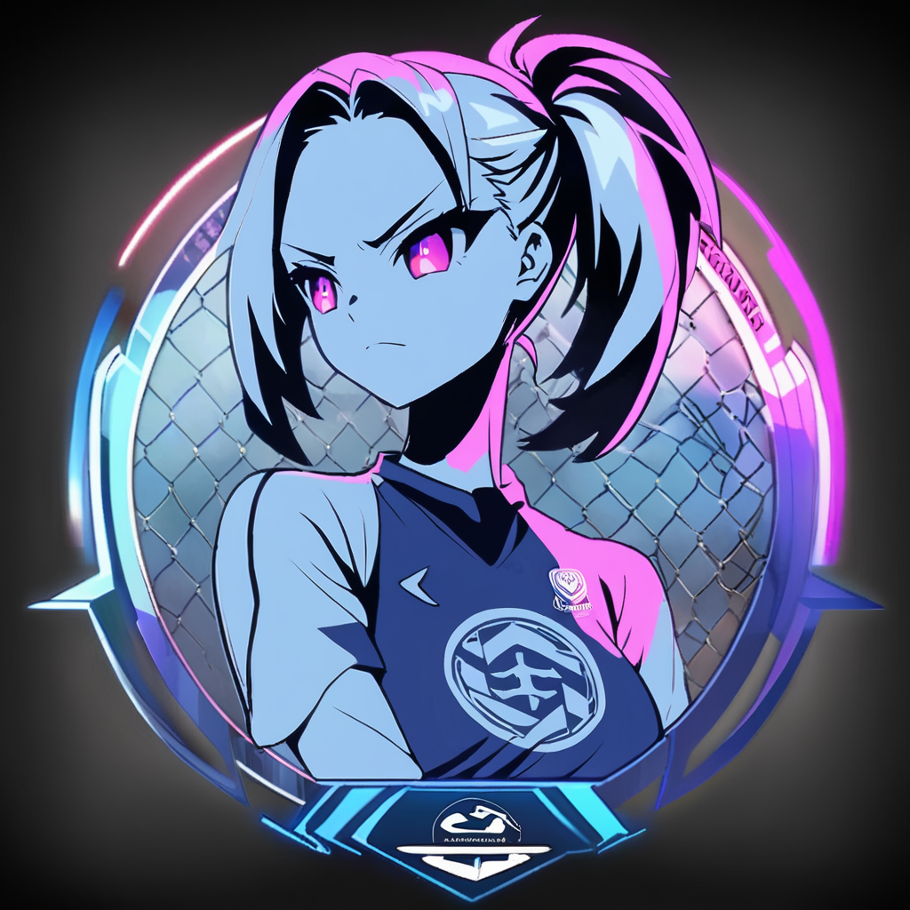

# KickSquad

A fun, interactive site where users can purchase random AI-generated soccer player cards. Each purchase increases the price by $0.01 for the next user, starting at $1.00, and the latest buyer’s name and card steal the spotlight on the homepage, fueling a lively, competitive vibe for soccer fans and collectors.

---

## Concept
KickSquad is a virtual soccer player platform with a unique spin: users collect bold, AI-crafted female soccer stars. Pay via Stripe to get a random player card, with the price rising by a penny after each purchase. The latest buyer’s name and card take center stage on the homepage, creating a playful, competitive atmosphere for soccer enthusiasts and collectors.

---

## How It Works
1. **Visit Homepage**: Check the current price (e.g., $1.02) and see the latest player card owner.
2. **Buy a Player**: Click "Buy Player," enter your name and payment details via Stripe.
3. **Get Your Card**: After payment, view your randomly assigned soccer star card.
4. **Homepage Spotlight**: Your name and card are displayed until the next purchase.
5. **Price Increase**: The next user pays $0.01 more, and the cycle continues.

---

## Implementation Guide

### 1. Generate Player Images
- **Tool**: Use Stable Diffusion to create 100 unique female soccer player cards.
- **Details**: Each player is a confident woman in soccer gear (e.g., jerseys, cleats), posed dynamically (e.g., kicking a ball), framed with thematic borders.
- **Resolution**: 1920x2688 pixels (5:7 aspect ratio, multiples of 8 for compatibility).
- **Storage**: Save images in `/static/players` or a cloud service like AWS S3, storing URLs for random assignment.

### 2. Technology Stack
- **Backend**: Bun with Elysia for server logic and routing.
- **Database**: PostgreSQL to track purchases.
- **Frontend**: Next.js with Tailwind CSS for styling and dynamic, server-rendered HTML updates.
- **Payments**: Stripe for secure transactions.
- **Security**: HTTPS via Let’s Encrypt SSL.

### 3. Database Setup
Create a `purchases` table in PostgreSQL:
- `purchase_id`: Unique purchase identifier.
- `user_name`: Buyer’s name or pseudonym.
- `player_image_url`: URL of the assigned player image.
- `price_paid`: Amount paid in USD (e.g., 1.03).
- `status`: Status of the purchase (e.g., pending, completed, canceled).
- `created_at`: Timestamp of the purchase.

### 4. Dynamic Pricing
- **Base Price**: $1.00.
- **Increase**: +$0.01 per completed purchase.
- **Calculation**: Query the number of completed purchases and calculate the price as 1.00 + (count × 0.01).

### 5. Stripe Integration
- **Setup**: Obtain Stripe API keys.
- **Flow**:
  1. User clicks "Buy Player."
  2. Server creates a pending purchase and calculates the current price.
  3. Stripe Checkout session includes the price, name field, and purchase identifier.
  4. Webhook at `/webhook` updates the purchase to ‘completed’ with a random player image URL.
- **Endpoints**: Success (`/success`), cancel (`/cancel`).

### 6. Homepage Design
- **Display**: Current price, latest buyer’s name, and player image (queried from the database for completed purchases, ordered by timestamp, limited to one).
- **Button**: "Buy Player" initiates the purchase process, using Next.js for dynamic updates without full page reloads.

### 7. Success Page
- **URL**: `/success?purchase_id=123`.
- **Content**: Shows the buyer’s player card if the purchase status is ‘completed’, using Next.js for partial updates.

### 8. Edge Cases
- **Concurrency**: Multiple users may buy at the same price; updates occur post-completion.
- **Canceled Payments**: Mark as ‘canceled’ or delete records.

---

## Part 2: [Another Part]

(Details for the second part of the project will be added here.)

---

## Notes
- **Player Variety**: Images feature diverse soccer positions (e.g., striker, midfielder, goalkeeper), all as bold female characters.
- **Privacy**: Users can use pseudonyms.
- **Scalability**: Cloud storage recommended for images if traffic grows.

KickSquad blends soccer thrills with virtual collecting—start building and rally your squad!

